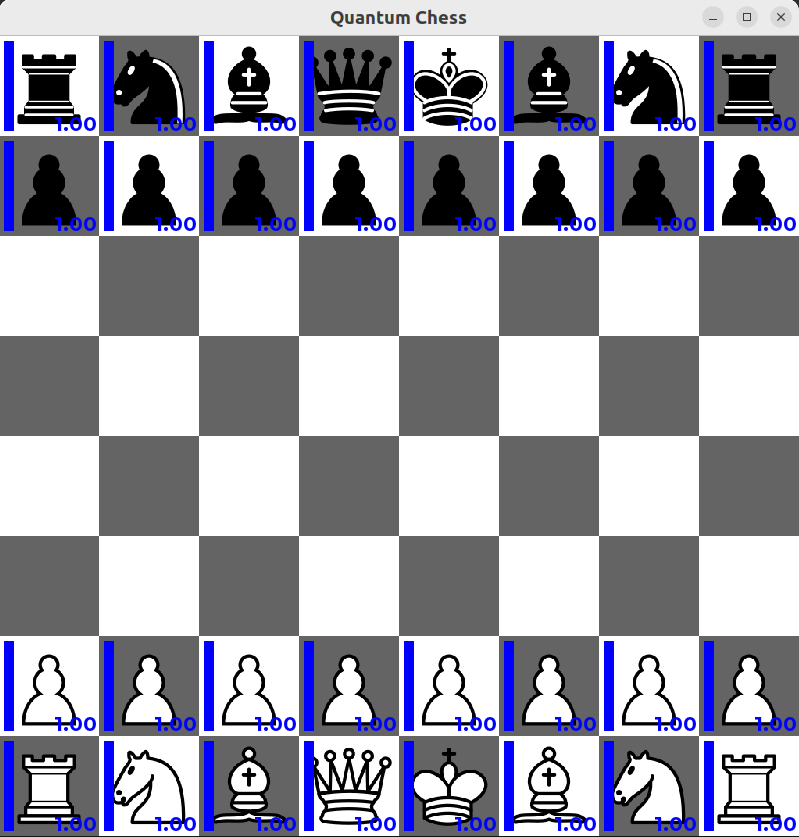

# Quantum Chess

Quantum Chess is a variation of the traditional chess where a piece can be in different tiles at the same time, showing quantum phenomena such as superposition and entanglement. This is a quantum chess implementation completely from scratch based on superposition of states in a binary tree structure.



## Dependencies
- cmake, build-essentials: for C++ project compilation.
- SFML: multimedia library for the user interface.
- Eigen: Linear Algebra library for matrices handling.
- libyaml-cpp: to import yaml files for configuration.
- OpenMP: code parallelization library for bots performance.


 ## Installation
 Just clone the repository and execute the script compile.sh. All dependencies will be installed and the project will be compilled with cmake.
```bash
git clone https://github.com/alvarolp02/quantum-chess.git
cd quantum-chess
./compile.sh
```
 ## Usage
To run the game with the default configuration (8x8 board) just execute the following script:
```bash
./run.sh
```

To load a custom board, select the board from the config folder (feel free to create new boards of any size!):
```bash
./run.sh config/6x6.yaml
```

The default players are both *human* for white and black moves. To select a bot as player, pass *botAB* or *botMCTS* as parameters:
```bash
./run.sh config/5x7.yaml botAB botMCTS
```

The summary of the command is:
```bash
./run.sh <board_yaml> <white_player> <black_player>
```

## Controls
- To select a piece, just left click on it, and the available moves will appear with a green outline.
- To do a standart move, left click on one of the available move.
- To do a split move, right click on two of the available moves (cannot be capture moves).